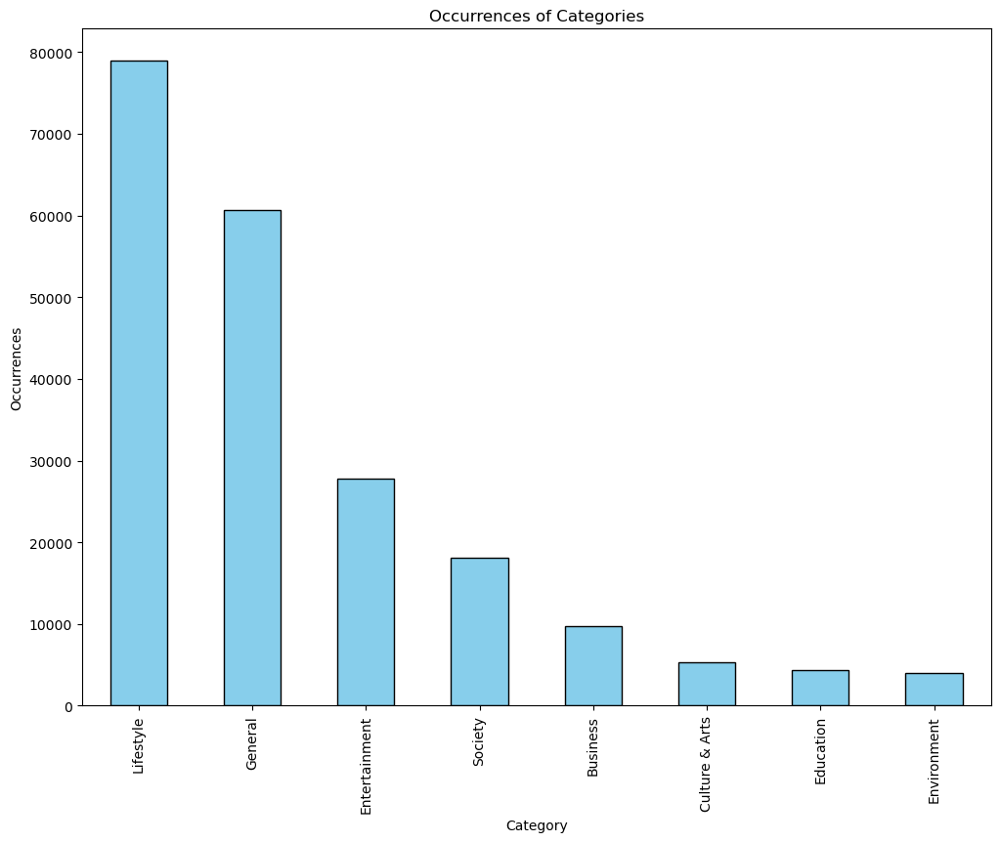

# News Category Classification

*Reuters newsroom in London. REUTERS/Simon Newman*

- ### Project Summary
  - #### Project Objective:
    This project aims to classify the category of a news entry based on its summary and short description. In particular, the goal is to classify the $i^{th}$ news entry $Y_i$, into exactly one category from $K$ categories, in which $Y_i \subseteq K$, based on a vector of word embeddings from the concatenated result from the headline and short description of the corresponding $i^{th}$ news entry $X_i$.
  - #### Project Overview:
    This project first deploys methods such as Latent Dirichlet Allocation and Wordclouds to provide the basis for feature transformation and data preprocessing. Subsequently, this project leverages the Bidirectional Encoder Representations from Transformers (BERT) model to vectorize the text, which, after applying dimension reduction with Principal Component Analysis, is then used to fit three distinct learning models with prior hyperparameter tuning in two of them. As a result, all three models achieved an accuracy of over 73%, with the best-performing model yielding an accuracy of over 74%.
    
    *Project flowchart and the corresponding Python notebook files*
  - #### Tech Stack
    - **Programming Languages:** Python
    - **Libraries & Frameworks:** Scikit-learn, TensorFlow, PyTorch, Transformers, NLTK, Hyperopt
    - **Feature Engineering:** TF-IDF, Word2Vec, BERT
    - **Machine Learning Models:** Logistic Regression, Support Vector Machine, Multilayer Perceptron
    - **Visualization:** Matplotlib, Seaborn, WordCloud
    - **Development & Tools:** Jupyter Notebook
- ### Data Source
  The dataset used for this analysis is the **"News Category Dataset" (News_Category_Dataset_v3.json)** dataset created by Rishabh Misra on [Kaggle](https://www.kaggle.com/datasets/rmisra/news-category-dataset/data).

- ### Data Structure
  This dataset contains 209,527 entries, with each entry representing one news entry, and six columns, with each column representing data related to that particular news entry. The columns, along with a snapshot of the dataset, are depicted in the table below.
  | link                                                                                               | headline                                                                                           | category   | short_description                                                                                                                            | authors                | date       |
  |----------------------------------------------------------------------------------------------------|---------------------------------------------------------------------------------------------------|------------|------------------------------------------------------------------------------------------------------------------------------------------------|------------------------|------------|
  | https://www.huffpost.com/entry/covid-boosters-uptake-us_n_632d719ee4b087fae6feaac9                | Over 4 Million Americans Roll Up Sleeves For Omicron-Targeted COVID Boosters                       | U.S. NEWS  | Health experts said it is too early to predict whether demand would match up with the 171 million doses of the new boosters the U.S. ordered | Carla K. Johnson, AP  | 2022-09-23 |
  | ... | ...                               | ...     | ...                                                                                   | ...     | ... |
  | https://www.huffingtonpost.com/entry/dwight-howard-rips-teammates-magic-hornets_us_5bb69b24e4b097869fd1b331 | Dwight Howard Rips Teammates After Magic Loss To Hornets               | SPORTS  | The five-time all-star center tore into his teammates Friday night after Orlando ... | N/A   | 2012-01-28 |

  *Sample snapshot of dataset*

- ### Data Cleaning and Preprocessing
  The purpose of this phase is to perform feature transformation and reduction prior to data analysis. In addition, missing values and duplicates are also identified and deleted.

  - #### Feature Removal
    Columns $authors$, $link$, and $date$ are dropped due to the limited value provided for the analysis. The link and date are irrelevant to the news category, and although the $authors$ column did not display any missing values, there are, in fact, 37,418 missing news entries that do not have an associated author. In addition, due to the presence of more than 29,000 unique authors, the $authors$ feature may only provide limited marginal information in addition to the content itself. Therefore, the $author$ feature is excluded from subsequent data analysis. 
  - #### Feature Transformation
    - **Category reduction:** Given the similarity between specific categories (e.g., CULTURE & ARTS and ARTS & CULTURE), the current 42 categories are merged into a new set of eight categories based on domain knowledge and a [sample](/samples_per_category.csv) of five news entries from each category. To examine how distinct the remaining eight categories are, Latent Dirichlet Allocation and Wordclouds are deployed to examine 1) the most important words in each topic and 2) the highest-frequency words of each topic, respectively. 
      
      *Sample Wordcloud result for six of the post-process categories*
    - **Headline and short_description merging:** Features $headline$ and $short description$ are also merged into a single feature $text$ to optimize computational efficiency since it can be inferred that the headline and the description of a news entry should contain similar information.
  - #### Entry Removal
    After performing feature removal, there are no columns; 471 duplicate entries are also removed.

- ### Exploratory Data Analysis
  After preprocessing, there are only two columns remaining: $text$, which is the product of the merging of $headline$ and $short description$, and $reduced category$, which represents the new classes after merging. Therefore, EDA in this project is limited in scope and primarily aimed at exploring the relationship between words and categories. In particular, EDA is aimed to address following two questions:

  - **What is the distribution of categories?**
    To address this question, a histogram is plotted after consolidating the original categories.
    
  - **What are the key terms associated with a specific category?**
    
    | Category         | Top Words                                                                 |
    |-----------------|--------------------------------------------------------------------------|
    | General         | trump, donald, new, president, said, people, says, trumps, gop, house  |
    | Entertainment   | new, trump, like, donald, star, video, time, says, game, watch         |
    | Lifestyle      | photos, new, day, time, like, make, life, best, people, want           |
    | Culture & Arts | art, new, artist, photos, life, like, world, years, time, people      |
    | Business       | new, business, people, time, money, apple, company, women, make, work |
    | Environment    | climate, change, week, new, animal, photos, world, dog, people, water |
    | Education      | college, new, students, education, school, scientists, space, science, time, like |
    | Society        | gay, women, black, new, people, like, love, day, time, trump         |
    
    To address this question, Latent Dirichlet Allocation is deployed to obtain the top words associated with each category. As our goal is to extract the most important words in each topic, we apply Latent Dirichlet Allocation differently with only one latent class in each category. More specifically, as opposed to identifying latent classes within each category, we aim to find the general key terms in each self-defined category to examine how accurate our categories are. As a result, we can observe that the key terms in each category generally align with the categories.

- ### Models
  Data analysis is performed throughout three phases: text vectorization, dimension reduction, and model fitting. 
  - #### Text Vectorization
    Prior to vectorizing, text is preprocessed with the _BertTokenizer_ function, which tokenizes chunks of text into individual tokens for subsequent vectorization. The following text vectorization is conducted with BERT, in particular, the _bert_base_uncased_ model. BERT was selected due to it being one of the state-of-the-art models in natural language processing. The output of BERT is a 768-dimension word embedding that represents the original text. GPU acceleration is also implemented to exploit parallel processing to reduce the runtime of the model. 
  - #### Dimension Reduction
    After vectorization, $X_i$ is a 768-dimension vector. As the complexity of some models scales exponentially with the dimension of $X_i$, dimension reduction is applied with Principal Component Analysis (PCA). PCA performs dimension reduction while maximizing the variance retained by the reduced dimensions. To select the number of principal components to be retained, a threshold of 90% is set, i.e. the principal components would capture 90% of the total variance of all features. After applying PCA, 286 principal components are retained, replacing the original word embeddings for subsequent model fitting.
    
    *Cumulative explained variance graph of PCA. The red dashed line represents the 90% level of cumulative variance explained.*
  - #### Model Fitting
    - **Hyperparameter tuning:** Prior to fitting each model, hyperparameters related to each model are first optimized through Bayesian Optimization with the package _hyperopt_. The package _hyperopt_ is chosen due to its flexibility over its parameters in the optimization process.
    - **Model selection:**
      - *Logistic Regression with l2 penalty:* Logistic regression is first applied due to its computation efficiency. Regularization is applied to lower the variance of the model in trade of slightly increased bias. Between $elasticNet$, $l1$, and $l2$ penalties, the $l2$ penalty is selected due to 1) computational efficiency over $elasticNet$ in large datasets, and 2) features should not be sparse after PCA processing. The solver parameter was set to $lbfgs$ based on the characteristics elaborated in the [scikit documentation](https://scikit-learn.org/stable/modules/linear_model.html). The hyperparameter optimized in Logistic Regression is the parameter $C$, which represents the regularization strength. 
      - *Linear Support Vector Classification:* Linear SVC is a special instance of a Support Vector Machine (SVM). It is recommended to be implemented on large datasets in practice and also in [scikit's documentation](https://scikit-learn.org/1.5/modules/generated/sklearn.svm.SVC.html#sklearn.svm.SVC). Linear SVC also applies a $l2$ regularization to the model by default. Therefore, the hyperparameter optimized in Linear SVC is also the parameter $C$, representing the regularization strength.
      - *Multilayer Perceptron:* Multilayer perceptron is a neural network that utilizes multiple hidden layers to capture the hierarchical features. Due to the high associated computational costs, hyperparameters were also selected based on best practices instead of extensive model tuning. A three-layer MLP is implemented with the $Adam$ optimizer, along with the loss function set as $sparseCategoricalCrossentropy$, a loss function often applied in datasets with integer $y$ labels.

    In addition, K-fold Cross-Validation with $K = 5$ is also implemented for model selection to lower the variance of the results.

- ### Results
  The results of the four models are summarized in the following table:

  | Model               | Accuracy   | Precision   | Recall    | F1-Score   |
  |:--------------------|:-----------|:------------|:----------|:-----------|
  | Logistic Regression | 0.740625   | 0.727775    | 0.740625  | 0.72769    |
  | LinearSVC           | 0.735234   | 0.723957    | 0.735234  | 0.713178   |
  | MLP                 | 0.744356   | 0.738371    | 0.744356  | 0.74052    |

- ### Limitations
  - The current category-defining process is based on domain knowledge with sampled data from each category. However, other algorithms may be deployed to further reduce inter-class similarity, therefore potentially optimizing the performance of the classification models. 
  - Implementing Bayesian Optimization on a more extensive range of hyperparameters may also further optimize model performance. However, hyperparameter tuning is limited due to constraints on computational resources. 
  - Implementing single-label classification may lower the performance of our model, as some of the news entries have a more "ambiguous" class. For instance, President Trump's interactions with SNL hosts are often categorized as $COMEDY$ in the original labels. However, the keyword "Trump" may lead the model to misclassify that news entry into $General$ (which encompasses political news). Therefore, implementing multi-label classification may address this issue by reflecting the nature of news having more than one category in real-world scenarios.  

- ### References
  [1] Simon Newman. "rtr1pc8i_0.jpg" Reuters Institute for the Study of Journalism, 31 October 2019, https://reutersinstitute.politics.ox.ac.uk/news/if-your-newsroom-not-diverse-you-will-get-news-wrong/ \
  [2] Rishabh Misra, News Category Dataset (Kaggle, 2022), https://www.kaggle.com/datasets/rmisra/news-category-dataset/data
