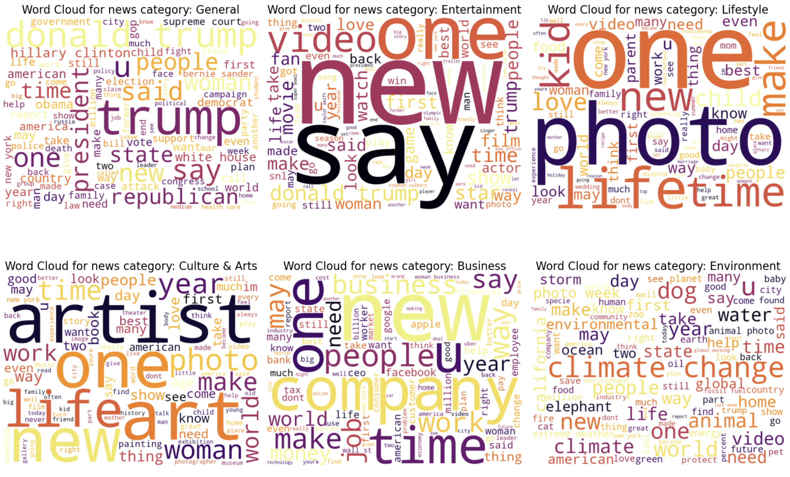
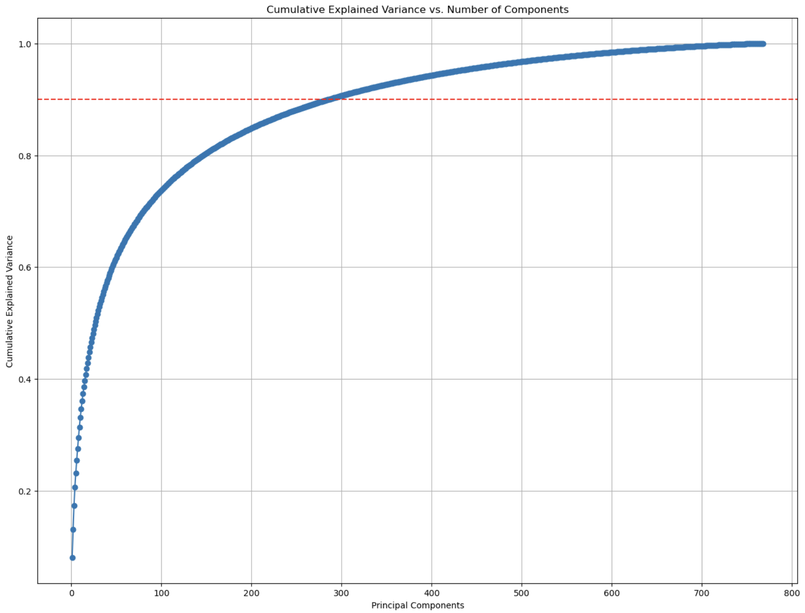

# News Category Classification

*Reuters newsroom in London. REUTERS/Simon Newman*

- ### Project Objective and Overview
  - #### Project Objective:
    This project aims to classify the category of a news entry based on its summary and short description. In particular, this project aims to classify the category of news entry $K_i$ based on a vector of transformed embeddings from the headline and the description of that news entry $X_i$, with $i$ representing one news entry or one row in the dataset.
  - #### Project Overview:
    This project first deploys methods such as Latent Dirichlet Allocation and Wordclouds to provide the basis for feature transformation and data preprocessing. Subsequently, this project leverages the Bidirectional Encoder Representations from Transformers (BERT) model to vectorize the text, which, after applying dimension reducuction with Principal Component Analysis, is then used to fit four distinct machine learning models with prior hyperparameter tuning. As a result, all four models achieved an accuracy of over 71%, with the best-performing model yielding an accuracy of over 74%.
    
    *Project flowchart and corresponding python notebook files*
- ### Data Source
  The dataset used for this analysis is the **"News Category Dataset" (News_Category_Dataset_v3.json)** dataset created by Rishabh Misra on [Kaggle](https://www.kaggle.com/datasets/rmisra/news-category-dataset/data).

- ### Data Structure
  This dataset contains 209,527 rows, with each row representing one news entry, and six columns, with each column representing data related to that particular news entry. The columns, along with a snapshot of the dataset, are depicted in the table below.

| link                                                                                               | headline                                                                                           | category   | short_description                                                                                                                            | authors                | date       |
|----------------------------------------------------------------------------------------------------|---------------------------------------------------------------------------------------------------|------------|------------------------------------------------------------------------------------------------------------------------------------------------|------------------------|------------|
| https://www.huffpost.com/entry/covid-boosters-uptake-us_n_632d719ee4b087fae6feaac9                | Over 4 Million Americans Roll Up Sleeves For Omicron-Targeted COVID Boosters                       | U.S. NEWS  | Health experts said it is too early to predict whether demand would match up with the 171 million doses of the new boosters the U.S. ordered | Carla K. Johnson, AP  | 2022-09-23 |
| ... | ...                               | ...     | ...                                                                                   | ...     | ... |
| https://www.huffingtonpost.com/entry/dwight-howard-rips-teammates-magic-hornets_us_5bb69b24e4b097869fd1b331 | Dwight Howard Rips Teammates After Magic Loss To Hornets               | SPORTS  | The five-time all-star center tore into his teammates Friday night after Orlando ... | N/A   | 2012-01-28 |

  *Sample snapshot of dataset*

- ### Data Cleaning and Preprocessing
  The purpose of this phase is to perform feature transformation and reduction prior to data analysis. In addition, missing values and duplicates are also identified and deleted.

  - #### Feature Removal:
    Columns $authors$, $link$, and $date$ are dropped due to the limited value provided for the analysis. The link and date are irrelevant to the news category, and although the $authors$ column did not display any missing values, there are, in fact, 37,418 missing news entries that do not have an associated author. In addition, due to the presence of more than 29,000 unique authors, the $authors$ feature may only provide limited marginal information in addition to the content itself. Therefore, the $author$ feature is excluded from subsequent data analysis. 
  - #### Feature Transformation:
    - **Category reduction:** Given the similarity between specific categories (e.g., CULTURE & ARTS and ARTS & CULTURE), the current 42 categories are merged into a new set of eight categories based on domain knowledge and a sample of five news entries from each category. To examine how distinct the remaining eight categories are, Latent Dirichlet Allocation and Wordclouds are deployed to examine 1) the most important words in each topic and 2) the highest-frequency words of each topic, respectively. 
      
      *Sample Wordcloud result for six of the post-process categories*
    - **Headline and short_description merging:** Features $headline$ and $short description$ are also merged into a single feature $text$ to optimize computational efficiency since it can be inferred that the headline and the description of a news entry should contain similar information.
  - #### Entry Removal:
    After performing feature removal, there are no columns; 471 duplicate entries are also removed.

- ### Exploratory Data Analysis
  After preprocessing, there are only two columns remaining: $text$, which is the product of the merging of $headline$ and $short description$, and $reduced category$, which represents the new classes after merging. Therefore, EDA in this project is limited, and primarily aimed to address the following two questions:

  - What is the distribution of categories?
  - What are the top words associated with a certain category?

- ### Data Analysis
  Data analysis is performed through three stages: text vectorization, dimension reduction, and model fitting. 
  - #### Text Vecorization
    Prior to vectorizing, text are preprocessed with the _BertTokenizer_ function, which tokenizes chunks of text into individual tokens for subsequent vectorization. The following text vectorization is conducted with BERT, in particular the _bert_base_uncased_ model. BERT is selected due to it being one of the state-of-the-art models in Natural Language Processing. The output of BERT is a 768-dimension word embedding that represents the original text.
  - #### Dimension Reduction
    After vectorization, $X_i$ is a 768-dimension vector. As the complexity of some of the models scale exponentially with the dimension of $X_i$, dimension reduction is applied with Principal Component Analysis (PCA). PCA performs dimension reduction while maximizing the variance retained by the reduced dimensions. To select the number of principal components to be retained, a threshold of 90% is set, i.e. the principal components would capture 90% of the total variance of all features. After PCA, 286 principal components are retained, replacing the original word embeddings for subsequent model fitting.
    
    *Cumulative explained variance graph of PCA. The red dashed line represents the 90% level of cumulative variance explained.*
  - #### Model Fitting
    - **Hyperparameter tuning:** Prior to fitting each model, hyperparameters related to each model are first optimized through Bayesian Optimization with the package _hyperopt_. The package _hyperopt_ is chosen due to its flexibility over its parameters in the optimization process.
    - **Model selection:**
      - Logistic Regression with l2 penalty: 

  In addition, K-fold Cross-Validation with $K = 5$ is also implemented for model selection to lower the variance of the results.

- ### Results
  The results of the four models are summarized in the following table:

  |Model|Accuracy|Precision|Recall|F1-Score|
  |-----|--------|---------|------|--------|
  |Logistic Regression|0.784456|0.783151|0.781385|0.782249|
  |LDA|0.784073|0.785103|0.776931|0.780966|
  |Random Forest|0.781987|0.786864|0.768155|0.777345|
  |XGBoost|0.780327|0.785842|0.765254|0.775327|

- ### Limitations
  - As current outlier detection is based on domain knowledge, incorporating a more sophisticated outlier detection algorithm may further improve the current classification results.
  - In practice, the impact of the gold difference at the 15-minute mark is not always deterministic of the outcome of the game. For example, for team compositions that are more late game-focused, a gold deficit at the 15-minute mark may have little to even no impact on the outcome of the game. Therefore, incorporating champion composition metadata of both teams may further increase prediction accuracy.
  - Incorporating player metadata (e.g., proficiency in champion, skill level) may also increase prediction accuracy, as the current dataset follows the assumption that all players are homogenous. 

- ### References

- 31st October 2019

  [1] Simon Newman. "rtr1pc8i_0.jpg" Reuters Institute for the Study of Journalism, 31 October 2019, https://reutersinstitute.politics.ox.ac.uk/news/if-your-newsroom-not-diverse-you-will-get-news-wrong/ \
  [2] Rishabh Misra, News Category Dataset (Kaggle, 2022), https://www.kaggle.com/datasets/rmisra/news-category-dataset/data
